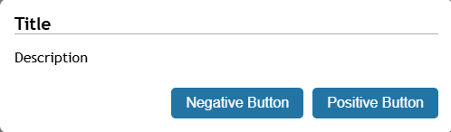
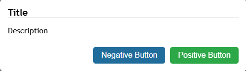
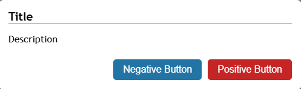

# Dialog Usage

## Alert Dialog

```tsx
import { useAlertDialog } from "./useDialog";
export function AppComponent() {
  const alertDialog = useAlertDialog();
  alertDialog.showAlert(title, message); // where (title: string, message: string)
}
```

## Confirm Dialog

### Generic Confirm Dialog

```tsx
import { useConfirmDialog } from "./useDialog";
export function AppComponent() {
  const confirmDialog = useConfirmDialog();

  async function handleAction() {
    const result = await confirmDialog.showConfirm(
      titleString,
      messageString,
      positiveBtnString,
      negativeBtnString,
    );
    if (result === true) {
      // Postive button clicked
    }
    if (result === false) {
      // Negative button clicked
    }
  }
}
```



## Confirm Dialog Safe Action

```tsx
const result = await confirmDialog.showConfirmSafe(
  titleString,
  messageString,
  positiveBtnString,
  negativeBtnString,
);
```



## Confirm Dialog Risky Action

```tsx
const result = await confirmDialog.showConfirmRisky(
  titleString,
  messageString,
  positiveBtnString,
  negativeBtnString,
);
```


